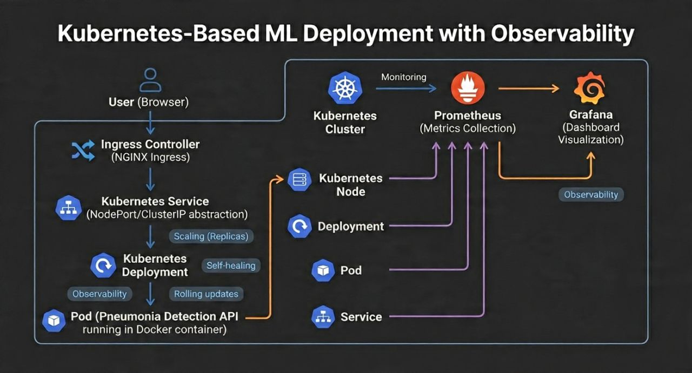

# Pneumonia Detection API – Production Deployment & MLOps

This repository details the cloud-native orchestration, continuous delivery pipeline, and automated observation layout for a high-availability medical image classification microservice.

## 🏗️ System Architecture


## ⚡ Core Infrastructure Features

- **Containerization & Image Optimization:** Built utilizing an optimized, multi-stage Docker configuration to isolate the deep learning execution dependencies (TensorFlow/Keras/FastAPI) while shrinking the final image footprint for rapid deployment cycles.
- **Automated CI/CD Pipeline:** Configured via GitHub Actions to automatically trigger on code-commits, execute structural lints, build production containers, and securely push tagged images to Docker Hub.
- **Kubernetes Orchestration:** Managed on a multi-node cluster employing NodePort and ClusterIP abstractions. Configured an NGINX Ingress Controller to securely handle, load-balance, and route incoming public client requests to the application gateway.
- **High Availability & Self-Healing:** Integrated explicit Kubernetes liveness and readiness probes paired with replication strategies to handle automatic pod Restarts, rolling updates, and zero-downtime hot reloads.
- **Full-Stack Observability:** Configured Prometheus targets to continuously scrape cluster-wide resource metrics and fed them into a custom Grafana dashboard monitoring live CPU/Memory draw, network load, and API performance metrics.

## 📁 Repository Structure
```text
├── .github/
│   └── workflows/
│       └── deploy.yml       # GitHub Actions CI/CD pipeline script
├── k8s/
│   ├── deployment.yml      # Kubernetes pod and replica configs
│   ├── ingress.yml         # NGINX Ingress traffic routing
│   └── monitoring.yml      # Prometheus metrics target mapping
├── Dockerfile              # Multi-stage container definition
└── README.md
